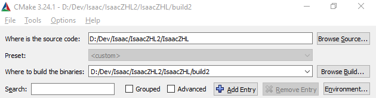
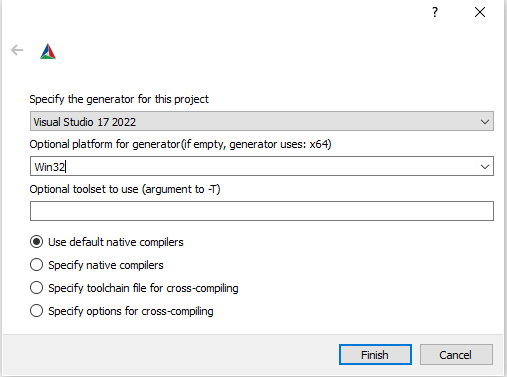

 
 
 

语言:[English](README.md)|简体中文

## 以撒模组 进入新时代

REPENTOGON是为《以撒的结合：忏悔+》的v1.9.7.12J273开发的Lua接口扩展模组，包含重要bug修复、功能扩展、以及性能提升。其安装可直接基于 **Steam上的当前最新版忏悔+** 进行。

社区常称此为“EXE模组”，REPENTOGON与传统模组的工作原理截然不同。此模组基于LibZHL，这是[抗生（Antibirth）](https://antibirth.com/)使用的框架。REPENTOGON直接hook至游戏内部，能操控原本模组无法触碰、或很难触碰（但牺牲性能可行、或需自行复刻）的一些机制。

# LUA接口文档
REPENTOGON为Lua接口进行增改，增加了大量新特性。在这里查看文档：[https://repentogon.com/docs.html](https://repentogon.com/docs.html)

# 安装
关于详细安装指南，参考[我们的网站](https://repentogon.com/install.html)。

# 构建
（如果你不是开发者，建议按照[我们网站](https://repentogon.com/install.html)上的安装指南进行，而不是进行这个步骤。）
### 构建要求
此项目要求使用与游戏相同的编译器。因此，必需使用Windows系统，以及以下内容：
* CMake 3.13或以上版本
* Git
* Visual Studio 2019或以上版本

### 步骤
我们假设本教程中使用Git Bash和CMake GUI。
1. *递归*克隆仓库: `git clone --recursive https://github.com/TeamREPENTOGON/REPENTOGON`
2. 打开CMake.
3. 在"Where is the source code"，选择克隆好的仓库（通常名为REPENTOGON）。
4. 在"Where to put the binaries"，选择任意文件夹。用于存放生成的文件。

5. 在CMake GUI界面最下面，点击"Configure"。
    * 首次构建时，需根据提示输入更多信息。
    * 编译器须匹配Visual Studio版本。
    * Platform**必须选择**Win32。
    * 其它选项保持默认，点击Finish。
    
6. 配置结束后点击"Generate"。会在前面指定的文件夹中生成.sln文件。
7. 使用Visual Studio打开生成的.sln文件。
8. 构建项目。非开发者建议使用Release模式，以获得性能提升。
9. 构建结束后，将`resources`、`resources-repentogon`、`dsound.dll`、`freetype.dll`、`libzhl.dll`、`Lua5.4.dll`以及`zhlREPENTOGON.dll`复制到游戏文件夹。
  * 可选：将`ISAAC_DIRECTORY`设置为游戏根目录，则构建结束后会自动复制。

# 许可协议
REPENTOGON使用GNU通用公共许可证第2版。

LibZHL使用MIT许可协议。文件夹`libzhl`和`libzhlgen`内的全部内容以MIT授权，但以下文件和文件除外（它们是REPENTOGON的组件：
* `libzhl/functions`及其内容
* `libzhl/IsaacRepentance_static.cpp`

`libs`中的文件夹是*外部依赖*，有其单独的许可信息。请参考这些文件夹（或递归依赖的子模块）获取更多信息。

# 赞助者
[Signpath](https://signpath.io/?utm_source=foundation&utm_medium=github&utm_campaign=repentogon)为我们的release提供免费的代码签名，感谢！

# 隐私声明
未经同意，REPENTOGON不会收集、不会传输任何用户数据。我们有自动更新机制，可选择性开启。该机制会在启动时将用户IP地址发送至GitHub，以检查是否有新版本。但除此以外，完全不会处理或存储任何其它数据。
