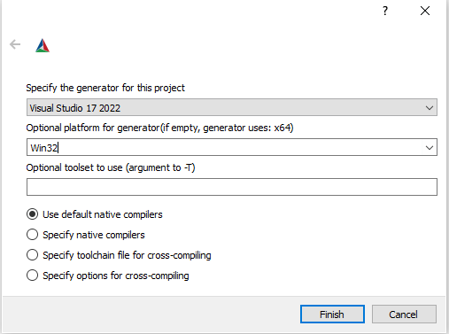

## A new era for Isaac modding begins now.

REPENTOGON is a mod for *The Binding of Isaac: Repentance* version v1.7.9b.J835 (untested and likely unsupported on other versions) that extends the Lua API with much-needed bug fixes, extra functionality, and performance enhancements.

Generally referred to as an "EXE mod" by the community, REPENTOGON works very differently than a traditional mod. Powered by *LibZHL*, the same framework used by *[Antibirth](https://antibirth.com/)*, REPENTOGON hooks directly into the game, allowing direct control over functionality which was previously impossible to replicate in mods, or would require significant  performance-intensive hacks or rewrites to replicate.

# LUA API Documentation
REPENTOGON makes additions and modifications to the Lua API and adds tons of new features. You can find the documentation here: [https://repentogon.com/docs.html](https://repentogon.com/docs.html)

# Installing
1. Download a build from [GitHub Actions](https://github.com/TeamREPENTOGON/REPENTOGON/actions/workflows/ci.yml).
2. Extract the contents of the zip file into your game's directory. You can find the directory by right clicking `The Binding of Isaac: Rebirth` in your Steam library page, clicking `Properties`, then `Installed Files` followed by `Browse` (located on the top right corner) on the window that appears.
   * If you are running the game on Linux via Proton, you will also need to access the `Properties` window, go to `General`, and enter `WINEDLLOVERRIDES="dsound=n,b" %command%` into the `Launch Options` entry. Without this launch option, REPENTOGON will be unable to load.
3. Launch the game. If REPENTOGON successfully loaded, you should now see `zhl.log` and `repentogon.log` files in your game directory, and the title bar should now say `Binding of Isaac: Repentance (+ REPENTOGON vX.X.X)`.

# Uninstalling
Technically, using the launch option `-repentogonoff` or removing `dsound.dll` is all that's needed to disable REPENTOGON, but for a "complete" uninstall:
1. Remove `dsound.dll`, `freetype.dll`, `libzhl.dll`, `Lua5.4.dll`, `resources-repentogon`, and `zhlREPENTOGON.dll` from the game folder.
2. Optionally, remove log files `dsound.log`, `repentogon.log`, and `zhl.log`.
2. Delete `resources\rooms` (containing `26.The Void_ex.stb`) and `resources\shaders` (containing `coloroffset_gold_mesafix`).
3. In the `resources\scripts` folder, remove `main_ex.lua` and `enums_ex.lua`.
4. In `User\Documents\My Games\Binding of Isaac Repentance` (or the Save Data Path in `savedatapath.txt`), delete the `Repentogon` folder. Note that this will erase all custom achievements and completion marks!

# Building
(Unless you're a developer, we recommend grabbing a build from [GitHub Actions](https://github.com/TeamREPENTOGON/REPENTOGON/actions/workflows/ci.yml) instead.)
### Requirements
The nature of this project requires that we use the same compiler as the game. As a result, a Windows system is explicitly required, along with the following:
* CMake 3.13 or above
* Git
* Visual Studio 2019 or above

### Steps
We assume Git Bash for the duration of this tutorial, as well as CMake GUI.
1. *Recursively* clone the repository: `git clone --recursive https://github.com/TeamREPENTOGON/REPENTOGON`
2. Launch CMake.
3. Under "Where is the source code", navigate to the root directory of the cloned repository (in most cases named REPENTOGON).
4. Under "Where to put the binaries", choose any folder. This is where the generated files will live.

5. At the bottom of the CMake GUI, hit "Configure".
    * If this is the first build, you will be prompted for more information. 
    * Compiler must match your Visual Studio version.
    * Platform **MUST** be Win32.
    * Leave all other options as default, and press Finish.
    
6. Once configuration is done, hit "Generate". This will create a .sln in the folder you specified before.
7. Open the generated .sln in Visual Studio.
8. Build the project. Unless you're a developer, we recommend Release mode for performance.
9. When the build is finished, copy `resources`, `resources-repentogon`, `dsound.dll`, `freetype.dll`, `libzhl.dll`, `Lua5.4.dll`, and `zhlREPENTOGON.dll` and to the game's folder.

# License
REPENTOGON is licensed under the GNU General Public License version 2.

LibZHL is licensed under the MIT license. All contents in the `libzhl` and `libzhlgen` folders are therefore licensed under MIT, with the exceptions of the following files and folders, which are components of REPENTOGON:
* `libzhl/functions` and its contents
* `libzhl/IsaacRepentance_static.cpp`

Folders in the `libs` folder are *external dependencies* and have their own licensing information. Check those folder (or, in the case of submodules, their respective dependencies) for further information.
