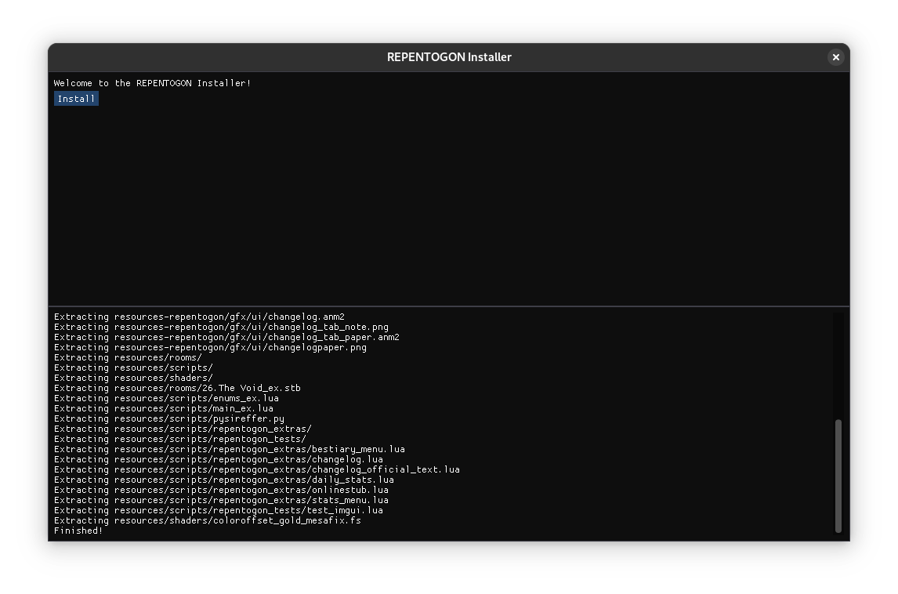

# Installation

We have two methods of installation: **Automatic** and **Manual.** We also have a **Steam Workshop** page that has a similar method to **Manual**.

## Automatic

???+ info 
    Automatic instructions only work on Windows for now. A Linux version of the installer is being worked on, and for now it should work in Wine, but there's still extra setup on there for now.

???+ info 
    We'll make this more automatic in the future, bear with us.

### What you'll need
* [The REPENTOGON installer (click here to download)](https://github.com/TeamREPENTOGON/Installer/releases/latest/download/REPENTOGONUpdater.exe)

### Instructions
1. Within Steam, navigate to *The Binding of Isaac: Rebirth*
2. Click on the gear to the right of the screen, and click on it
3. Click on `Properties`
    - This opens a new window.

4. Navigate to `Installed Files`, then click `Browse`
    - This opens a new window.

5. Copy the `REPENTOGONUpdater.exe` downloaded earlier to the folder that just opened.

6. Run `REPENTOGONUpdater.exe`.
    - This opens a new window.
7. Press `Install`.
    -   Once the log at the bottom says `Finished!`, installation is done. If the log instead says *anything* about failing, the installation was unsuccessful. Try a different method.

???+ info 
    On Linux and Steam Deck, add `WINEDLLOVERRIDES="dsound=n,b" %command%` as a launch option for Isaac.

## Manual

### What you'll need
* [The latest release of REPENTOGON (click here to download)](https://github.com/TeamREPENTOGON/REPENTOGON/releases/latest/download/REPENTOGON.zip)

### Instructions
1. Within Steam, navigate to *The Binding of Isaac: Rebirth*
2. Click on the gear to the right of the screen, and click on it
3. Click on `Properties`
    - This opens a new window.

4. Navigate to `Installed Files`, then click `Browse`
    - This opens a new window.

5. Extract the *contents* of `REPENTOGON.zip` to the folder that just opened.

???+ info 
    On Linux and Steam Deck, add `WINEDLLOVERRIDES="dsound=n,b" %command%` as a launch option for Isaac.
## Steam Workshop

### What you'll need
* [REPENTOGON from the Steam Workshop](https://steamcommunity.com/sharedfiles/filedetails/?id=3127536138)

### Instructions
1. Within Steam, navigate to *The Binding of Isaac: Rebirth*
2. Click on the gear to the right of the screen, and click on it
3. Click on `Properties`
    - This opens a new window.

4. Navigate to `Installed Files`, then click `Browse`
    - This opens a new window.

5. Navigate to the `mods` folder, then `REPENTOGON_3127536138`.

6. Extract the *contents* of `REPENTOGON.zip` to the game's folder.

???+ info 
    On Linux and Steam Deck, add `WINEDLLOVERRIDES="dsound=n,b" %command%` as a launch option for Isaac.

You can now unsubscribe from the mod on Steam, if you wish.