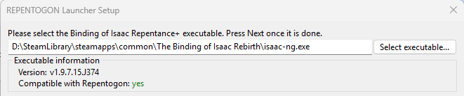
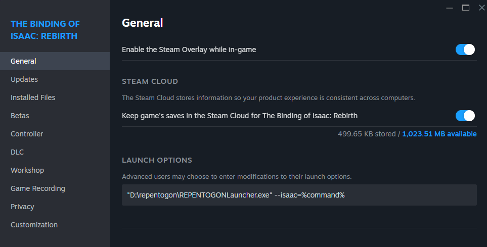
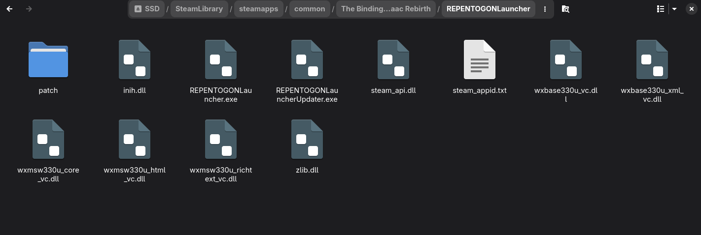
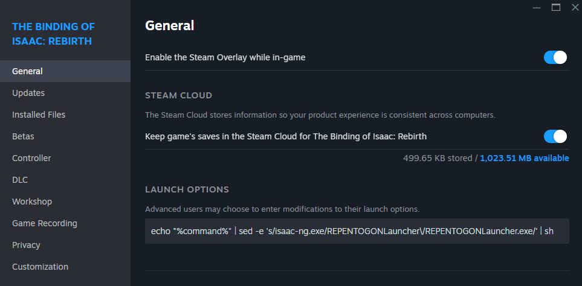
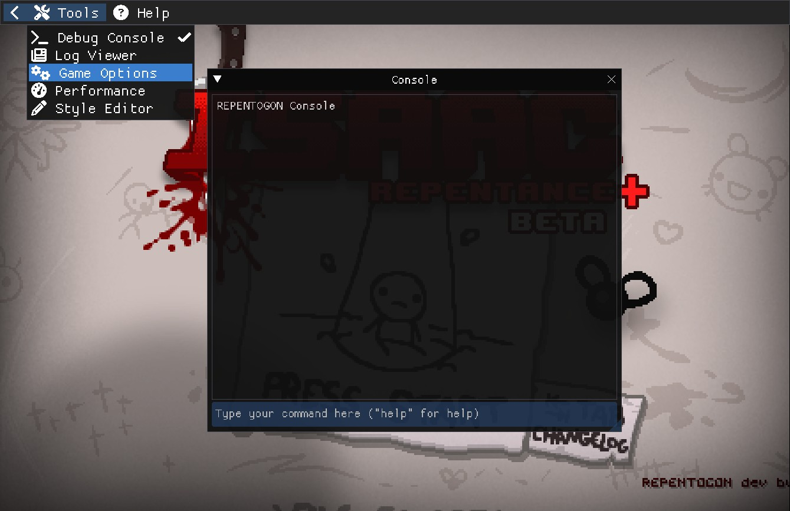
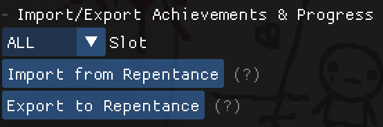
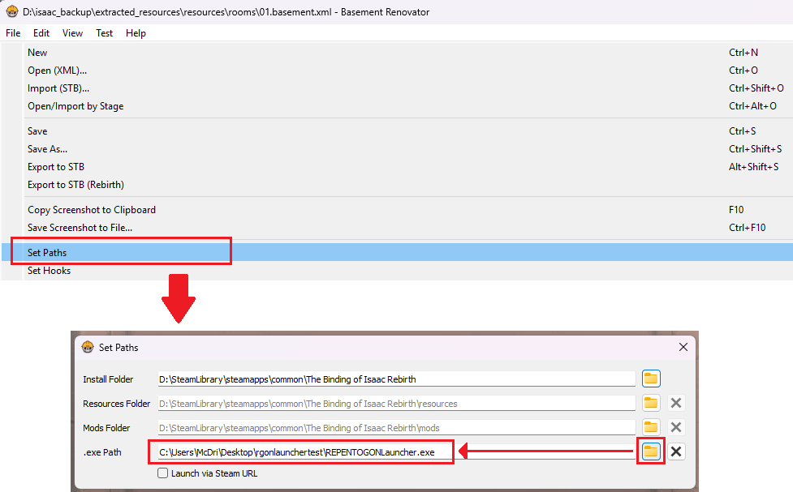

# Installation & FAQ

???+ info
    If you prefer a video guide, check out [Catinsurance's installation instructions video](https://youtu.be/hF4ngfDn364)!

In order to install and run REPENTOGON, you'll need:

* The REPENTOGON Launcher (see OS-appropriate installation steps below)
* **One** of the following:
    * The latest official Steam version of The Binding of Isaac: Repentance+
    * The Binding of Isaac: Repentance+ v1.9.7.12.J273

# Instructions (Windows)

## Obtaining the Launcher

There are two ways you may obtain the REPENTOGON Launcher- either by downloading it yourself, or automatically by upgrading from a legacy installation of REPENTOGON.

### Manually
* Download the [REPENTOGON Launcher](https://github.com/TeamREPENTOGON/Launcher/releases/latest)
* Extract the REPENTOGON Launcher to a directory of your choosing, *except* directly into Isaac's installation folder, or into a folder named `repentogon` in the Isaac installation folder
    * These folders need to be accessed or modified by the launcher later, so it cannot reside there

### Automatically (upgrading from legacy version)
* If you had a legacy installation of the Repentance version of REPENTOGON, it may have notified you about the Repentance+ update, automatically downloaded the Launcher, and created a shortcut on your desktop. If needed, you can find the Launcher's files in your Isaac installation directory, under the `REPENTOGONLauncher` subfolder

## Installing REPENTOGON

* Run `REPENTOGONLauncher.exe` or your `REPENTOGON` shortcut
    * The Launcher's initial setup window will open

???+ info
    The Launcher will check for updates on startup. Please keep the launcher as up to date as possible to ensure proper functionality.

* The launcher's initial setup window will ask for the location of the Binding of Isaac: Repentance+ executable
    * This may be auto-detected
    * If this is not auto-detected, click `Select executable...` and locate your `isaac-ng.exe`, then click `Next` to continue



???+ info
    If the launcher says your installation of Isaac is *not* compatible with REPENTOGON, note that you must have either:

    * The Binding of Isaac+ Repentance+ **v1.9.7.12.J273**
    * The latest official Steam version of The Binding of Isaac+ Repentance+
        * If a new update just released, try updating the launcher, and if that doesn't work, be patient! It may take us up to a day to release a new patch for that version.


???+ info
    If the installation fails, or the Launcher reports that the installation is corrupt, you may need to try one of the following:

    * Click `Choose exe` in the main Launcher window to repeat first-time setup
    * Click `Advanced options...` in the main Launcher window, then select `Re-install/Repair REPENTOGON`
    * If both of those fail, navigate to the game's installation folder, delete the `repentogon` subfolder and launch the launcher again

## (Optional/RECOMMENDED) Launching REPENTOGON through Steam

If you wish, you can make it so that launching Isaac through Steam runs the REPENTOGON Launcher instead. **This is REQUIRED for Steam Remote Play to function properly with REPENTOGON!**

* Within Steam, navigate to *The Binding of Isaac* Rebirth*
* Click on the gear towards the right side of the screen, and select `Properties`
    * This will open a new window


* Under `General`, locate the `Launch Options` field, and enter `"(PATH TO REPENTOGONLauncher.exe)" --isaac=%command%`

???+ info
    `(PATH TO REPENTOGONLauncher.exe)` MUST be replaced with the full path to your REPENTOGON launcher executable. See the example below.

    * If you received an automatic download of the Launcher from a legacy version of REPENTOGON, your Launcher files may be located under the game's installation directory, which can be found by selecting "Installed Files" in the below Steam menu.

    

# Instructions (Linux / Steam Deck) 

* On Steam Deck, exit to **Desktop Mode**
* Within Steam, navigate to *The Binding of Isaac* Rebirth*
* Click on the gear towards the right side of the screen, and select `Properties`
    * This will open a new window


* Navigate to `Installed Files`, then click `Browse`
    * This will open the game's installation directory
* Create a new folder within the Isaac installation directory called `REPENTOGONLauncher`
    * If the folder already exists and already contains a `REPENTOGONLauncher.exe`, you may have received an automatic download of the Launcher from the legacy REPENTOGON updater used for the old Repentance version. This is fine, and you may skip the next step
* Download the [REPENTOGON Launcher](https://github.com/TeamREPENTOGON/Launcher/releases/latest)
* Extract the REPENTOGON Launcher into the newly created `REPENTOGONLauncher` subdirectory



* Return to the prior Steam menu and navigate to `General`
* In the `Launch Options` field, copy and paste the following:
```
echo "%command%" | sed -e 's/isaac-ng.exe/REPENTOGONLauncher\/REPENTOGONLauncher.exe/' | sh
```
    * Launching Isaac through Steam will now launch the REPENTOGON Launcher instead



* Launch Isaac, which will run the REPENTOGON Launcher

???+ info
    The Launcher will check for updates on startup. Please keep the launcher as up to date as possible to ensure proper functionality.

* The launcher's initial setup window will ask for the location of the Binding of Isaac: Repentance+ executable
    * This may be auto-detected
    * If this is not auto-detected, click `Select executable...` and locate your `isaac-ng.exe`, then click `Next` to continue


???+ info
    If the launcher says your installation of Isaac is *not* compatible with REPENTOGON, note that you must have either:

    * The Binding of Isaac+ Repentance+ **v1.9.7.12.J273**
    * The latest official Steam version of The Binding of Isaac+ Repentance+
        * If a new update just released, try updating the launcher, and if that doesn't work, be patient! It may take us up to a day to release a new patch for that version.

???+ info
    If the installation fails, or the Launcher reports that the installation is corrupt, you may need to try one of the following:

    * Click `Choose exe` in the main Launcher window to repeat first-time setup
    * Click `Advanced options...` in the main Launcher window, then select `Re-install/Repair REPENTOGON`
    * If both of those fail, navigate to the game's installation folder, delete the `repentogon` subfolder and launch the launcher again

# Frequently Asked Questions

## Why is there a launcher now (short answer)?

Here is a quick summary. You may read below for detailed explanation (that also give insight into the development of the launcher itself, if you are interested):

* The initial motivation for the launcher was that we were in need of a universal solution to load REPENTOGON. Our DLL-based load method proved to be incompatible with some setups.
* The second motivation came from the need to settle on one version of the game, due to the comparatively fast release cycle of Repentance+ that was keeping REPENTOGON stuck in an endless cycle of porting.
* The third motivation came from savefile structure-related changes that could result in complete loss of data if a savefile from one version is loaded on another version of the game.

## Why is there a launcher now (long answer)?

The launcher was initially motivated by the need for an alternate solution to load REPENTOGON: some users running on some versions of Windows were not able to run REPENTOGON, and we realized there would be no universal solution that relied on DLLs only. Thus the launcher was born. This happened shortly before the announcement of Repentance+.

As versions of Repentance+ began rolling around, so began the process of porting REPENTOGON to these versions. Unlike traditional Lua mods that rely on a well-defined API that remains (mostly) stable between the different versions of the game, REPENTOGON relies on reverse-engineering the structure of the game that is volatile across versions. Due to the relatively fast release cycle initiated by Nicalis, porting REPENTOGON was becoming an endless task, as all our work on one version would be outdated before we even finished porting. Thus we decided to select one version as our release version: v1.9.7.12.J273. This meant people would need to downgrade the game to run REPENTOGON. As this process can be tricky, we opted to use the launcher to achieve that.

This became the second motivation for the launcher: a tool that would seamlessly downgrade the game to a REPENTOGON-compatible version. 

A third motivation came from structural changes to savefiles: these are different between v1.9.7.12.J273 and the latest release, to the point that attempting to load a savefile from one version with a different version can obliterate the entire savefile. In particular, attempting to load a REPENTOGON-compatible savefile on the latest release can obliterate all achievements. The launcher adds several counter-measures to the Isaac executable.

## Why is there a mod manager in the launcher? Doesn’t the game already have one?

The mod manager was a side-project by one of the launcher’s devs. When we integrated it into the launcher and ported their work on REPENTOGON to completely replace the game’s mod management logic, we realized it significantly improved load times as well as mod management time in general. Thus it was kept in.

## Where is <certain thing that was added in a recent Repentance+ update\>?

The current version of REPENTOGON runs on **The Binding of Isaac: Repentance+ v1.9.7.12.J273**. While the Launcher allows for an easy installation process using the latest official version of Repentance+, this means that while running the game using REPENTOGON, the game will be missing some of the latest official patches.

Porting a project like REPENTOGON to a newer version of the game takes a long time, and can introduce a lot of bugs/instability that take time to find and iron out. As Repentance+ was still in active development, we decided to release REPENTOGON+ based on v1.9.7.12 in order to get it out there for modders and players to start using again, and to allow us to start developing new features without being forced to port to every new patch that comes out.

## The Launcher says that my REPENTOGON installation is broken/invalid!

You may need to try the following:
    * **Be sure you followed the above installation instructions, *especially* if you use Linux or a Steam Deck!**
    * Restart the Launcher and make sure to accept any update prompts
    * Click `Choose exe` in the main Launcher window to repeat first-time setup, and make sure the correct Isaac executable is selected
    * Click `Advanced options...` in the main Launcher window, then select `Re-install/Repair REPENTOGON`
    * If all of the above fails, navigate to the game's installation folder, delete the `repentogon` subfolder and launch the launcher again

If you still have issues, or if this issue occurs repeatedly, [feel free to reach out for help](#reporting--contact).

## Can I use Steam to start the REPENTOGON Launcher? / Steam Remote Play doesn’t work!

Making it so Steam runs the REPENTOGON Launcher when starting Isaac is an optional step in the Windows installation process, and a mandatory one for Linux. Additionally, this is required for Steam Remote Play to function properly.
Please refer to the [above installation instructions.](#optionalrecommended-launching-repentogon-through-steam)

## Help! I'm missing some of my achievements/unlocks!

The Binding of Isaac: Repentance+ uses a separate save file from base Repentance, even without REPENTOGON. However, Repentance+ only imports your save data from Repentance once, the first time you ever launch Repentance+! This means that if you had launched Repentance+ at any time in the past, then returned to Repentance, your Repentance+ save data is likely still stuck at the point when you previously launched it.

Thankfully, REPENTOGON allows you to freely import your missing achievements/unlocks from Repentance, OR export any newly gained achievements/unlocks back to Repentance!

* From the **Title Screen**, press the **~** key to open the REPENTOGON Console
* In the top left corner of the screen, navigate to **Tools**, then **Game Options**
    * A new window will appear



* Navigate to the **Save Management** tab
* Select **Import from Repentance** to import all of your missing achievements and unlocks from your Repentance save file
    * If the button is disabled, make sure you are on the **title screen!**
    * The import/export process will never remove existing achievements or progress. It will only unlock ones that are obtained in one version but missing on the other



## How do I use Basement Renovator with REPENTOGON?

* First, make sure your Basement Renovator is up to date. **Basement Renovator needs to be at least version 3.3.1 to work with REPENTOGON.** Grab the latest version [here](https://github.com/Basement-Renovator/basement-renovator/releases/latest).
* Make sure you have already downloaded the REPENTOGON Launcher and went through the [initial setup process](#installation--faq), and have confirmed that REPENTOGON is working
* In Basement Renovator, navigate to `File` -> `Set Paths`
    * A dialog window will appear
* Change your `.exe Path` to point to your `REPENTOGONLauncher.exe`
* The game will now launch with REPENTOGON when testing rooms. If there are any issues (such as a broken installation), the Launcher will appear instead



## Reporting / Contact

Bugs, issues or suggestions can be posted in the corresponding Github Issues pages for [REPENTOGON](https://github.com/TeamREPENTOGON/REPENTOGON/issues) or the [Launcher](https://github.com/TeamREPENTOGON/Launcher/issues). When reporting bugs or issues, please include relevant log files. These can be easily located via the “Check Game Logs” button in the main Launcher window.

Additionally, you can visit the **#repentogon** channel in [The Modding of Isaac Discord server!](https://discord.gg/HCRNEytxNB)