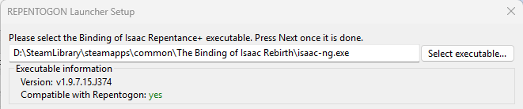
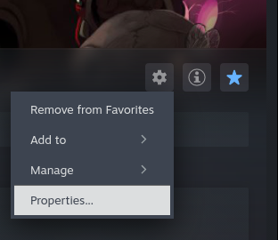
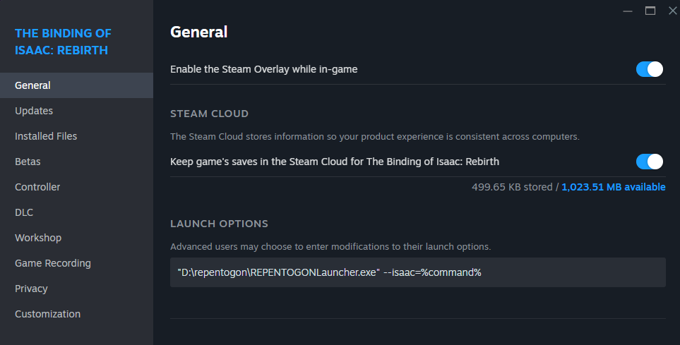
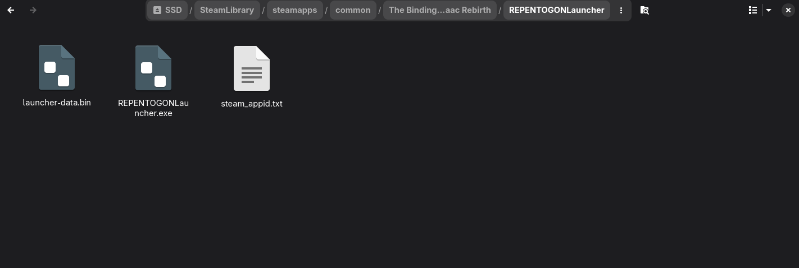
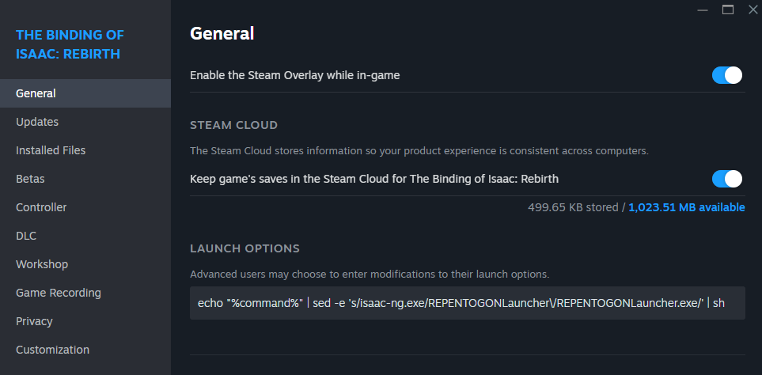
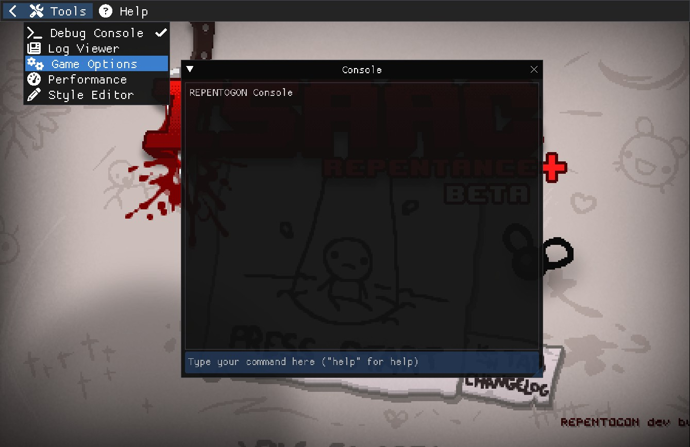
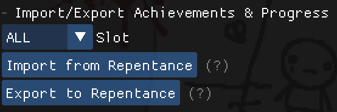
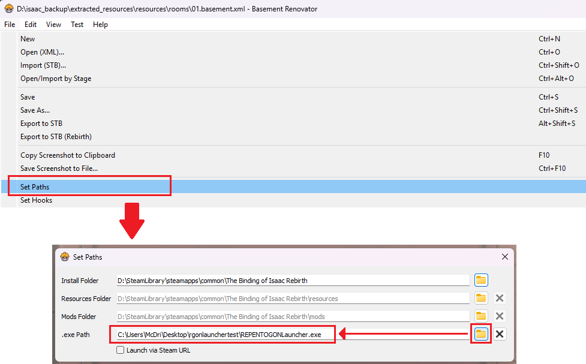

# 安装 & 常见问题 {#installation--faq}

???+ info
    如需视频教程，请参考[Catinsurance's的安装指南（YouTube，英文）](https://youtu.be/hF4ngfDn364)  
    如果页面内容过期，请以[英文页面](install.md)为准。

为了安装运行REPENTOGON，你需要：

* REPENTOGON启动器（Launcher）（操作系统不同，则安装方式不同，见下文）
* 以下游戏版本**之一**:
    * 以撒的结合：忏悔+的最新官方Steam版本
    * 以撒的结合：忏悔+ v1.9.7.12.J273

# 安装指南 (Windows)

## 获取启动器（Launcher）

有两个方法：第一个是手动下载，第二个是从旧版本的REPENTOGON自动升级。


???+ info
    译注：启动器会尝试从Github获取更新，如果失败则会从Steam创意工坊获取更新。  
    启动器支持识别系统代理，请确保你的系统环境能够流畅访问上述渠道之一。

### 手动下载
* 下载 [REPENTOGON启动器](https://github.com/TeamREPENTOGON/Launcher/releases/latest)
* 自己找一个地方，解压启动器，**不要**直接解压到以撒安装目录下，更**不要**解压到以撒安装目录下的`repentogon`文件夹
    * 这些文件夹需要后续由启动器访问/修改，所以不能把启动器放在这里

### 自动升级 （从旧版本自动升级）
* 如果装过旧版本的REPENTOGON，它会提示你升级到忏悔+，自动下载启动器，并在桌面创建一个快捷方式。如有需要，你可以在以撒安装目录的`REPENTOGONLauncher`文件夹内找到启动器文件。

## 安装REPENTOGON

* 运行`REPENTOGONLauncher.exe`，或者`REPENTOGON`快捷方式
    * 首次运行会弹出启动器的首次设定窗口

???+ info
    启动器会在启动后检查更新。请保持启动器版本最新，以确保功能正常。  

* 启动器的首次设定窗口会询问`以撒的结合：忏悔+`的可执行文件位置
    * 有自动检测功能
    * 如果没有检测成功，点击`Select executable...`并选择你游戏的`isaac-ng.exe`文件，然后点击`Next`继续



???+ info
    如果启动器的`Compatible with Repentogon`（兼容REPENTOGON）不是yes，注意你需要：

    * 以撒的结合：忏悔+ **v1.9.7.12.J273**
    * 最新官方Steam版本的以撒的结合：忏悔+
        * 如果游戏新版本刚刚发布，请尝试升级启动器。如果还不行，请耐心等待。我们可能需要约一天时间来为新版本发布补丁。
    * 译注：中文补丁会修改原版游戏，请校验完整性（去除补丁）后使用REPENTOGON。


???+ info
    如果安装失败，或启动器报告安装已损坏，你可能需要尝试：

    * 点击启动器主界面中的`Choose exe`，以重新进行首次设定
    * 点击启动器主界面中的`Advanced options...`然后选择`Re-install/Repair REPENTOGON`
    * 如果都不行，到游戏安装文件夹中，删除`repentogon`文件夹，然后再次运行启动器。

## (可选/<u>推荐</u>) 在Steam启动REPENTOGON {#optionalrecommended-launching-repentogon-through-steam}

如果希望的话，按下面步骤操作，就可以在Steam中启动以撒来运行启动器。**如需Steam远程畅玩在REPENTOGON上工作，此步骤必需！**

* 在Steam上，转到*The Binding of Isaac: Rebirth*
* 点击屏幕右侧的齿轮，然后选择`属性`
    * 这会打开新窗口



* 在`通用`，`启动选项`，输入`"(启动器文件REPENTOGONLauncher.exe路径)" --isaac=%command%`

???+ info
    `(启动器文件REPENTOGONLauncher.exe路径)`**必须**替换成REPENTOGON启动器的完整路径。不要括号，保留引号。示例见下面。

    * 如果你是从旧版本的REPENTOGON自动升级的，启动器文件可能会在游戏安装路径下。可以通过在Steam上选择“已安装文件”找到。

    

# 安装指南 (Linux / Steam Deck) 

* 在Steam Deck上，退出到**桌面模式（Desktop Mode）**
* 在Steam里，转到*The Binding of Isaac: Rebirth*
* 点击屏幕右侧的齿轮图标，选择`属性`
    * 这会打开新的窗口


* 转到`已安装文件`，点击`浏览`
    * 这会打开游戏安装目录
* 在安装目录下，创建一个新的文件夹，名为`REPENTOGONLauncher`
    * 如果文件夹已存在，且包含文件`REPENTOGONLauncher.exe`，则可能是已经从旧版REPENTOGON自动升级下载了启动器。这个没问题，可以跳过下一步
* 下载 [REPENTOGON启动器](https://github.com/TeamREPENTOGON/Launcher/releases/latest)
* 解压到新创建的`REPENTOGONLauncher`里面



* 返回刚刚的Steam菜单，点击`通用`
* 在`启动选项`中，复制粘贴以下内容：
```
echo "%command%" | sed 's|isaac-ng.exe|REPENTOGONLauncher/REPENTOGONLauncher.exe|' | sh
```
    * 如果从Steam里打开以撒，现在就会运行启动器了



* 启动以撒，然后REPENTOGON启动器就打开了

???+ info
    启动器会在启动后检查更新。请保持启动器版本最新，以确保功能正常。

* 启动器的首次设定窗口会询问`以撒的结合：忏悔+`的可执行文件位置
    * 有自动检测功能
    * 如果没有检测成功，点击`Select executable...`并选择你游戏的`isaac-ng.exe`文件，然后点击`Next`继续


???+ info
    如果启动器的`Compatible with Repentogon`（兼容REPENTOGON）不是yes，注意你需要：

    * 以撒的结合：忏悔+ **v1.9.7.12.J273**
    * 最新官方Steam版本的以撒的结合：忏悔+
        * 如果游戏新版本刚刚发布，请尝试升级启动器。如果还不行，请耐心等待。我们可能需要约一天时间来为新版本发布补丁。
    * 译注：中文补丁会修改原版游戏，请校验完整性（去除补丁）后使用REPENTOGON。

???+ info
    如果安装失败，或启动器报告安装已损坏，你可能需要尝试：

    * 点击启动器主界面中的`Choose exe`，以重新进行首次设定
    * 点击启动器主界面中的`Advanced options...`然后选择`Re-install/Repair REPENTOGON`
    * 如果都不行，到游戏安装文件夹中，删除`repentogon`文件夹，然后再次运行启动器。

# 常见问题

## 为什么现在要用启动器（简单回答）？

下面是简单说明。后面也有详细说明（如果感兴趣，里面也有一些启动器本身的开发见解）：

* 最初动机是我们想要一个加载REPENTOGON的通用方案。我们基于DLL的加载方式在某些环境下不可用。
* 第二个动机来自固定游戏版本的需求。忏悔+的发布周期相对较快，这会让REPENTOGON陷入无尽的移植工作。
* 第三个动机来自不同版本存档结构相关的变化。如果一个游戏版本去加载另一个版本的存档，会导致数据完全丢失。

## 为什么现在要用启动器（长回答）？

启动器一开始是为了提供一个加载REPENTOGON的备选方案：有些用户的Windows系统无法运行REPENTOGON，我们意识到只依赖DLL是没有通用的解决方案的。所以启动器就诞生了。这件事发生的时间略早于忏悔+的宣布时间。

随着忏悔+开始滚动迭代，REPENTOGON也开始移植到这些版本。传统Lua模组依赖的是有良好定义的API，大多数在不同版本之间是稳定的，但REPENTOGON不一样，它依赖对游戏结构的逆向，这在每个游戏版本上都是不同的。由于Nicalis的发布周期变快，移植REPENTOGON变成一个无止尽的工作，因为如果我们在一个版本上进行移植，在移植结束之前，它就已经过时了。所以我们决定选择一个版本作为我们发行的版本：v1.9.7.12.J273。这就是说人们需要降级游戏来运行REPENTOGON。因为这个过程会有些难做，我们用启动器来完成它。

这就成了使用启动器的第二个动机：一个用来将游戏无缝降级至REPENTOGON兼容版本的工具。

第三个原因来自存档结构的变换：v1.9.7.12.J273与最新版本的存档有区别，严重时，用一个版本加载另一个不同版本的存档可能损坏整个存档文件。具体来说，在最新版本上尝试加载REPENTOGON兼容的存档会丢失所有成就。启动器为以撒的可执行文件增加了若干的应对措施。

## 为什么启动器中有一个mod管理器？游戏本身不是已经有了吗？

这个mod管理器是启动器开发过程中的附属项目之一。当我们把它集成到启动器里、然后移植到REPENTOGON中来替代游戏原本的mod管理逻辑时，我们意识到它显著改进了游戏加载时间，还有多数情况下的mod管理时间。所以就留着了。

## <最近忏悔+更新的一些东西\>在哪里？

目前REPENTOGON运行在**以撒的结合：忏悔+ v1.9.7.12.J273**版本上。虽说启动器能基于忏悔+的最新官方版本上一键安装，但如果游戏使用REPENTOGON加载，就会失去一些新版本的官方修复。

像REPENTOGON这样的项目，把它移植到新版本游戏会耗费相当长的时间，还会引入特别多bug/不稳定因素，需要用很长时间去排查。因为忏悔+依然还在不断开发，我们决定基于v1.9.7.12来发行REPENTOGON+，这能让mod创作者和玩家再次用回REPENTOGON，同时也能让我们开始开发一些新特性，同时无需在新版本出现时被迫进行移植工作。

## 启动器说我的REPENTOGON安装损坏/无效！

可以尝试这些事操作：

* **确保你跟着前面的步骤做了，*特别是*Linux或者Steam Deck！**
* 重启启动器，如有更新提示，则更新一下
* 点击启动器主窗口上的`Choose exe`来重做首次配置，确保选择正确的以撒可执行文件
* 点击启动器主窗口上的`Advanced options...`，然后选择`Re-install/Repair REPENTOGON`
* 如果以上都做了还不行，转到游戏安装文件夹，删除`repentogon`目录，然后重新打开启动器。

如果你还有问题，或者问题反复出现，[可以来寻求我们的帮助](#Reporting--Contact)。

## 我能用Steam启动REPENTOGON启动器吗？ / Steam远程畅玩无法工作！

在Steam上启动以撒来打开REPENTOGON解释器，是Windows安装步骤中的一个可选步骤。且在Linux中是强制步骤。此外，Steam远程畅玩必须这样设置。
请参阅[上面的安装说明。](#optionalrecommended-launching-repentogon-through-steam)

## 求救！我的成就丢失了！

以撒的结合：忏悔+与忏悔用了不同的存档文件（没有REPENTOGON也会这样）。然而，忏悔+只会从忏悔导入一次存档，也就是你第一次启动忏悔+的时候！这就是说如果你曾经启动过忏悔+，然后回退到忏悔，你的忏悔+存档就会停滞在上次游玩忏悔+状态。

值得庆幸的是，REPENTOGON能让你从忏悔版本自由导入缺失的成就/解锁项，或者，将新获得成就/解锁项导出回忏悔！

* 在**标题界面**，按 **~** 键打开REPENTOGON控制台
* 在屏幕左上角，选择**Tools**，然后选择**Game Options**
    * 这个步骤会弹出新窗口



* 切换到**Save Management**选项卡
* 选择**Import from Repentance**，来从忏悔存档导入缺失的成就和解锁项
    * 如果按钮不可用，确保你在**标题界面！**
    * 导入/导出操作完全不会移除已存在的成就或进度。它只会在一个存档上解锁当前存档缺失、但另一个存档中存在的成就。



## 我要如何在REPENTOGON中使用Basement Renovator？

* 首先，确认Basement Renovator版本。 **Basement Renovator需要3.3.1或以上版本，才能与REPENTOGON协同工作** 在[这里](https://github.com/Basement-Renovator/basement-renovator/releases/latest)获得最新版本。
* 确保已下载REPENTOGON启动器，并完成[首次设定过程](#installation--faq)，且确认REPENTOGON能正常工作
* 在Basement Renovator中，选择`File` -> `Set Paths`
    * 此步骤会弹出对话框
* 修改`.exe Path`为`REPENTOGONLauncher.exe`
* 在测试房间时，就会以REPENTOGON启动游戏。同时，如果出现任何问题（比如安装受损），则会弹出启动器界面。



## 报告问题 / 联系我们 {#Reporting--Contact}

Bug、问题与建议可以通过REPENTOGON的[Github Issues](https://github.com/TeamREPENTOGON/REPENTOGON/issues)页面提出，或在[启动器的Issue页面](https://github.com/TeamREPENTOGON/Launcher/issues)提出。在报告bug或提问题时，请附带相关的日志文件。这些文件可以通过点击启动器上的“Check Game Logs”按钮获取。

此外，也可以访问[The Modding of Isaac Discord server](https://discord.gg/HCRNEytxNB)上的**#repentogon**频道。
